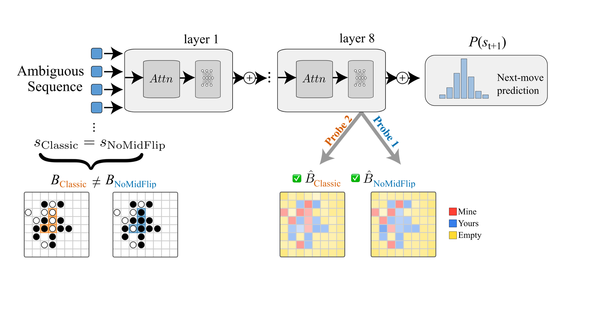
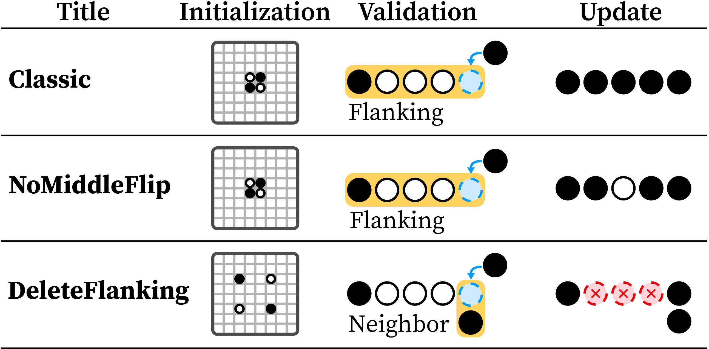

<div class="hero">
  <h1>MetaOthello: A Controlled Study of Multiple World Models in Transformers</h1>

  <p class="authors">
    <a href="https://aviralchawla.github.io" target="_blank" rel="noopener">Aviral Chawla</a><sup>1,*</sup> &nbsp;
    <a href="https://galenhall.net" target="_blank" rel="noopener">Galen Hall</a><sup>2,*</sup> &nbsp;
    <a href="https://juniperlovato.com" target="_blank" rel="noopener">Juniper Lovato</a><sup>1</sup>
  </p>

  <p class="affiliations">
    <sup>1</sup>Vermont Complex Systems Institute, University of Vermont &nbsp;·&nbsp;
    <sup>2</sup>University of Michigan
  </p>

  <p class="equal-contrib">*Equal contribution</p>

  <p class="venue-caption">ICML 2026 &nbsp;·&nbsp; Seoul, South Korea</p>

  <div class="button-row">
    <a class="btn btn-primary" href="https://arxiv.org/abs/2602.23164" target="_blank" rel="noopener"><span class="btn-icon">&#9998;</span> arXiv</a>
    <a class="btn" href="https://github.com/aviralchawla/metaothello" target="_blank" rel="noopener"><span class="btn-icon">&#9733;</span> Code</a>
    <a class="btn" href="https://huggingface.co/aviralchawla/metaothello" target="_blank" rel="noopener"><span class="btn-icon">&#129303;</span> Models</a>
    <a class="btn" href="https://huggingface.co/datasets/aviralchawla/metaothello" target="_blank" rel="noopener"><span class="btn-icon">&#129303;</span> Dataset</a>
    <a class="btn" href="#cite"><span class="btn-icon">&#10088;&#10089;</span> Cite Us</a>
  </div>
</div>

<div class="hero-image-wrap">
  
  <p class="hero-caption">A single move sequence can be legal under two different Othello rule sets at once. MetaOthello trains one transformer on mixed rule systems and asks: whose board state does it actually track &mdash; and how?</p>
</div>

<section id="abstract">
<div class="wrap">

## Abstract

<p class="abstract-body">
Foundation models must handle multiple generative processes, yet mechanistic interpretability largely studies capabilities in isolation; it remains unclear how a single transformer organizes multiple, potentially conflicting &ldquo;world models&rdquo;. Previous experiments on Othello-playing neural networks test world-model learning, but focus on a single game with a single set of rules. We introduce <em>MetaOthello</em>, a controlled suite of Othello-like games with shared syntax but different rules or tokenizations, and train small GPTs on mixed-variant data. We show that transformers trained on multiple Othello variants learn <strong>shared world-state representations</strong>: linear probes trained on one game intervene on another&rsquo;s board state nearly as well as matched probes. When the games conflict, the model resolves the resulting <em>ambiguity</em> through a localized mechanism we identify and steer. For isomorphic games with token remapping, representations are equivalent up to a single orthogonal rotation that generalizes across layers, showing the shared structure is abstract rather than tied to surface form. Together, these results show that transformers reconcile conflicting world models by sharing structure and localizing conflict. <em>MetaOthello</em> thus offers a path toward understanding how transformers organize many world models at once.
</p>

</div>
</section>

<section id="framework">
<div class="wrap-wide">

## The MetaOthello Framework

<p class="lede">A shared 8&times;8 board and vocabulary, several incompatible rule sets.</p>

<div class="figure-block">
  
</div>
<p class="figure-caption"><strong>Game variants.</strong> Each MetaOthello variant shares the same board and token vocabulary but differs in its validation rule (what makes a move legal) and its update rule (which tiles flip as a result). <em>Classic</em> and <em>NoMiddleFlip</em> share a flanking-based validation rule but update the board differently; <em>DeleteFlanking</em> changes both the validation rule (neighbor-based) and the update rule (flanked tiles are removed rather than flipped). Because the games diverge in different ways, an early move sequence is often legal &mdash; and consistent with different board states &mdash; under more than one rule set at once.</p>

</div>
</section>

<section id="findings">
<div class="wrap-wide">

## Key Findings

<div class="findings-grid">
  <div class="finding-card">
    <div class="finding-number">1</div>
    <h3>Shared, causally interchangeable representations</h3>
    <p>Transformers trained on multiple Othello variants do not partition capacity into isolated sub-models. Board-state representations are largely shared and abstract: linear probes trained on one game causally intervene on another&rsquo;s internal state nearly as well as matched probes.</p>
  </div>
  <div class="finding-card">
    <div class="finding-number">2</div>
    <h3>The model also learns to route game identity</h3>
    <p>Beyond tracking board state, the model performs a second job: a localized mid-layer circuit constructs and identifies which game is being played, and steering it causally controls which rule system the model applies to an ambiguous sequence.</p>
  </div>
  <div class="finding-card">
    <div class="finding-number">3</div>
    <h3>When game sequences diverge, a targeted mechanism resolves the ambiguity</h3>
    <p>The model shares representation where games agree and diverges only where rules conflict. Rather than maintaining fully separate world models, it localizes conflict to an identifiable, steerable mechanism.</p>
  </div>
</div>

</div>
</section>

<section id="cite">
<div class="wrap">

## Cite Us

If you find MetaOthello useful, please cite our paper:

</div>

<div class="wrap cite-wrap">

```bibtex
@inproceedings{chawla2026metaothello,
  title     = {MetaOthello: A Controlled Study of Multiple World Models in Transformers},
  author    = {Chawla, Aviral and Hall, Galen and Lovato, Juniper},
  booktitle = {Proceedings of the 43rd International Conference on Machine Learning},
  series    = {Proceedings of Machine Learning Research},
  volume    = {306},
  year      = {2026},
  address   = {Seoul, South Korea},
  publisher = {PMLR}
}
```

</div>
</section>

<footer class="site-footer">
  <p class="footer-authors">
    <a href="https://aviralchawla.github.io" target="_blank" rel="noopener">Aviral Chawla</a> &nbsp;·&nbsp;
    <a href="https://galenhall.net" target="_blank" rel="noopener">Galen Hall</a> &nbsp;·&nbsp;
    <a href="https://juniperlovato.com" target="_blank" rel="noopener">Juniper Lovato</a>
  </p>
  <p>Vermont Complex Systems Institute, University of Vermont &nbsp;·&nbsp; University of Michigan</p>
  <p>Site built with <a href="https://observablehq.com/framework/" target="_blank" rel="noopener">Observable Framework</a>. Source on <a href="https://github.com/aviralchawla/metaothello" target="_blank" rel="noopener">GitHub</a>.</p>
</footer>
