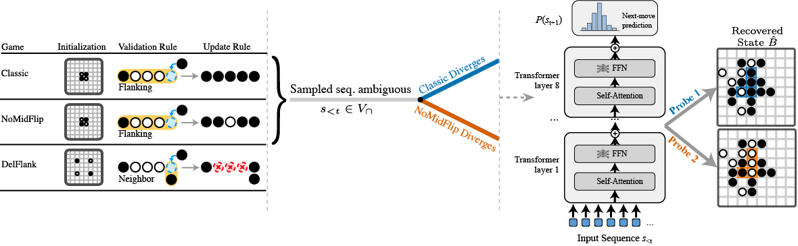
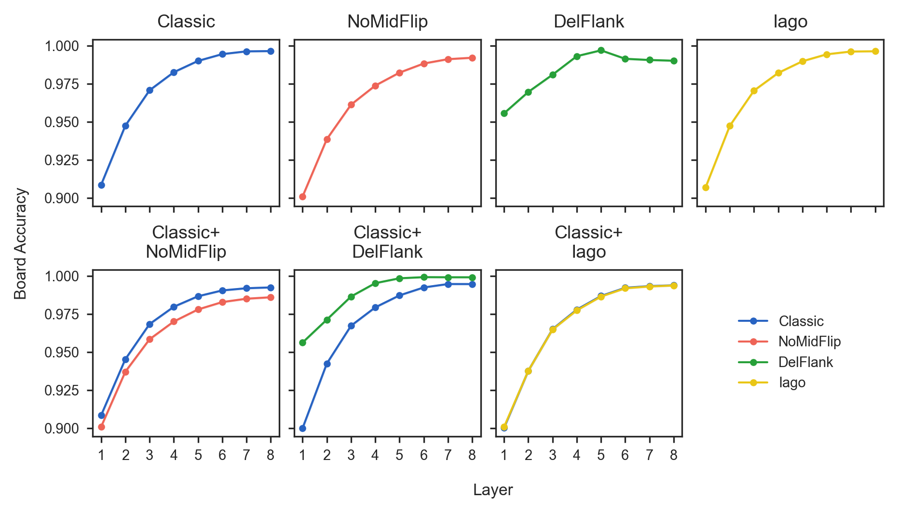
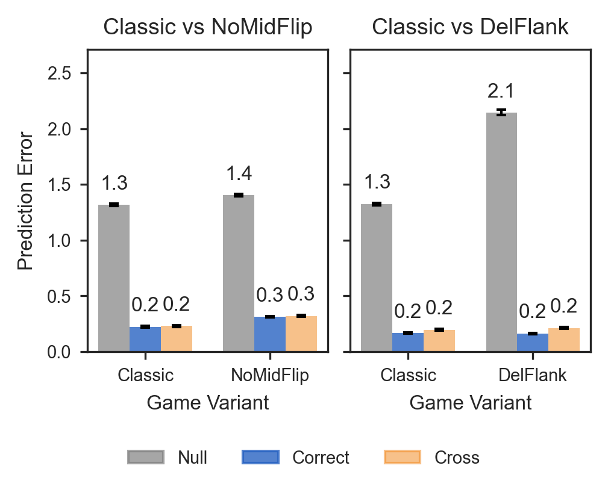
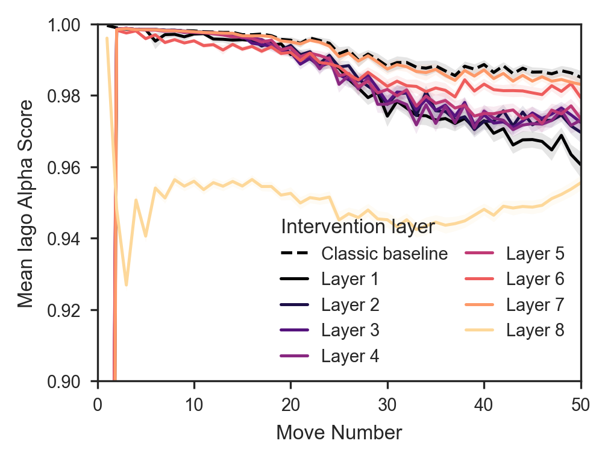
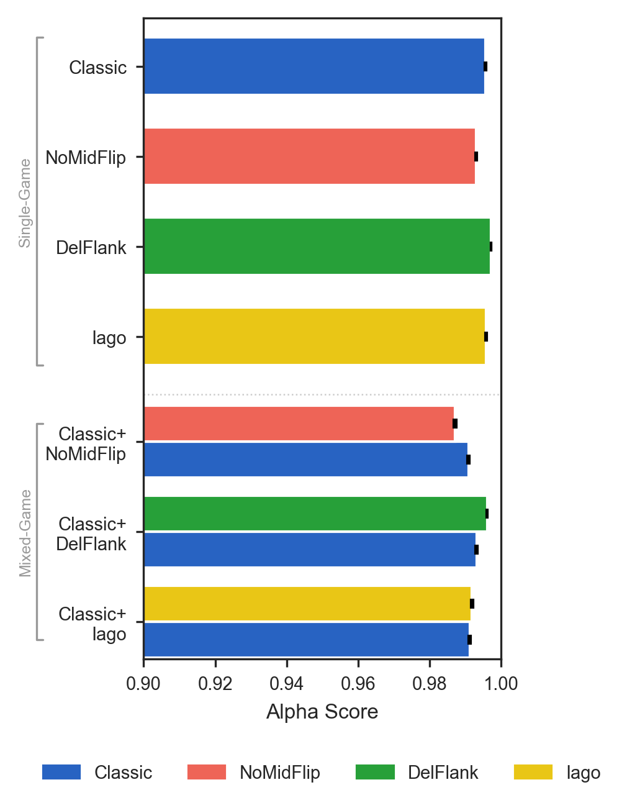
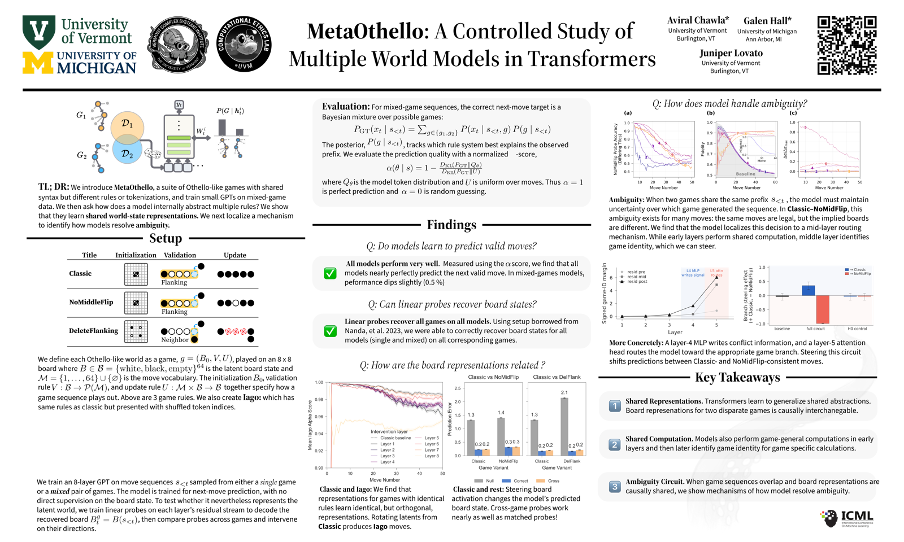

<div class="hero">
  <div class="venue-badge">ICML 2026 &nbsp;·&nbsp; Seoul, South Korea</div>

  <h1>MetaOthello: A Controlled Study of Multiple World Models in Transformers</h1>

  <p class="authors">
    <a href="https://aviralchawla.github.io" target="_blank" rel="noopener">Aviral Chawla</a><sup>1,*</sup> &nbsp;
    <a href="https://galenhall.net" target="_blank" rel="noopener">Galen Hall</a><sup>2,*</sup> &nbsp;
    <a href="https://juniperlovato.com" target="_blank" rel="noopener">Juniper Lovato</a><sup>1</sup>
  </p>

  <p class="affiliations">
    <sup>1</sup>Vermont Complex Systems Institute, University of Vermont &nbsp;·&nbsp;
    <sup>2</sup>University of Michigan
  </p>

  <p class="equal-contrib">*Equal contribution</p>

  <div class="button-row">
    <a class="btn btn-primary" href="https://arxiv.org/pdf/2602.23164" target="_blank" rel="noopener"><span class="btn-icon">&#128196;</span> Paper</a>
    <a class="btn" href="https://arxiv.org/abs/2602.23164" target="_blank" rel="noopener"><span class="btn-icon">&#9998;</span> arXiv</a>
    <a class="btn" href="https://github.com/aviralchawla/metaothello" target="_blank" rel="noopener"><span class="btn-icon">&#9733;</span> Code</a>
    <a class="btn" href="https://huggingface.co/aviralchawla/metaothello" target="_blank" rel="noopener"><span class="btn-icon">&#129303;</span> Models</a>
    <a class="btn" href="https://huggingface.co/datasets/aviralchawla/metaothello" target="_blank" rel="noopener"><span class="btn-icon">&#129303;</span> Dataset</a>
    <a class="btn" href="#poster"><span class="btn-icon">&#127916;</span> Poster</a>
    <a class="btn" href="#citation"><span class="btn-icon">&#10088;&#10089;</span> BibTeX</a>
  </div>
</div>

<div class="hero-image-wrap">
  
  <p class="hero-caption">A single move sequence can be legal under two different Othello rule sets at once. MetaOthello trains one transformer on mixed rule systems and asks: whose board state does it actually track &mdash; and how?</p>
</div>

<section id="abstract">
<div class="wrap">

## Abstract

<p class="abstract-body">
Foundation models must handle multiple generative processes, yet mechanistic interpretability largely studies capabilities in isolation; it remains unclear how a single transformer organizes multiple, potentially conflicting &ldquo;world models&rdquo;. Previous experiments on Othello-playing neural networks test world-model learning, but focus on a single game with a single set of rules. We introduce <em>MetaOthello</em>, a controlled suite of Othello-like games with shared syntax but different rules or tokenizations, and train small GPTs on mixed-variant data. We show that transformers trained on multiple Othello variants learn <strong>shared world-state representations</strong>: linear probes trained on one game intervene on another&rsquo;s board state nearly as well as matched probes. When the games conflict, the model resolves the resulting <em>ambiguity</em> through a localized mechanism we identify and steer. For isomorphic games with token remapping, representations are equivalent up to a single orthogonal rotation that generalizes across layers, showing the shared structure is abstract rather than tied to surface form. Together, these results show that transformers reconcile conflicting world models by sharing structure and localizing conflict. <em>MetaOthello</em> thus offers a path toward understanding how transformers organize many world models at once.
</p>

</div>
</section>

<section id="method">
<div class="wrap-wide">

## The MetaOthello Framework

<p class="lede">A shared 8&times;8 board and vocabulary, several incompatible rule sets, and linear probes that recover whichever board state the model is actually tracking.</p>

<div class="figure-block">
  
</div>
<p class="figure-caption"><strong>The MetaOthello framework.</strong> <em>(Left)</em> We define a universe of games sharing a board size and vocabulary but differing in dynamics &mdash; e.g., which flanking rule flips a tile. <em>(Middle)</em> We sample move sequences from these games. Early in a game, a sequence is often valid under more than one rule set, creating an informational conflict for the model. <em>(Right)</em> We train a small GPT on mixed-variant sequences and use linear probes on the residual stream to reconstruct the internal board representation implied by each rule set.</p>

</div>
</section>

<section id="findings">
<div class="wrap-wide">

## Key Findings

<div class="findings-grid">
  <div class="finding-card">
    <div class="finding-number">1</div>
    <h3>Cross-variant alignment</h3>
    <p>Transformers trained on heterogeneous game data do not partition capacity into isolated sub-models. Board-state representations learned for one game transfer causally to others: linear probes trained on one variant intervene on another&rsquo;s internal state with effectiveness approaching matched probes.</p>
  </div>
  <div class="finding-card">
    <div class="finding-number">2</div>
    <h3>Syntax invariance</h3>
    <p>For isomorphic games with scrambled tokenization, representations are equivalent up to a single orthogonal rotation that generalizes across layers &mdash; showing the model learns abstract structure independent of surface tokens.</p>
  </div>
  <div class="finding-card">
    <div class="finding-number">3</div>
    <h3>Economization &amp; causal routing</h3>
    <p>The model shares representation where games agree and diverges only where rules conflict. A localized mid-layer circuit constructs and routes game identity: steering it causally controls which rule system the model applies to an ambiguous prefix, while a matched control does not.</p>
  </div>
</div>

</div>
</section>

<section id="results">
<div class="wrap-wide">

## Results

<p class="lede">A sample of the quantitative evidence behind each finding &mdash; see the paper for the full set of ablations, variants, and controls.</p>

<div class="gallery-grid">
  <div class="gallery-item">
    
    <div class="gallery-item-body">
      <h3>Board state is decodable at every layer</h3>
      <p>Linear probes recover the true board state with &gt;97% accuracy by the final layer, for every single-game and mixed-game model &mdash; mixing rule systems does not degrade probe accuracy.</p>
    </div>
  </div>
  <div class="gallery-item">
    
    <div class="gallery-item-body">
      <h3>Cross-game probes intervene almost as well as matched probes</h3>
      <p>Steering with a probe trained on a <em>different</em> variant (&ldquo;Cross&rdquo;) reduces prediction error nearly as much as steering with the game&rsquo;s own probe (&ldquo;Correct&rdquo;) &mdash; both far below the untargeted (&ldquo;Null&rdquo;) baseline.</p>
    </div>
  </div>
  <div class="gallery-item">
    
    <div class="gallery-item-body">
      <h3>A single rotation aligns isomorphic games</h3>
      <p>One learned orthogonal rotation &Omega;, applied to Classic activations, recovers valid Iago moves &mdash; and stays close to the Classic baseline across the whole game and at nearly every layer.</p>
    </div>
  </div>
  <div class="gallery-item">
    
    <div class="gallery-item-body">
      <h3>Multi-game training costs little accuracy</h3>
      <p>Move-prediction alpha-scores for mixed-game models stay within about a point of matched single-game models &mdash; the model absorbs a second rule system cheaply.</p>
    </div>
  </div>
</div>

</div>
</section>

<section id="poster">
<div class="wrap-wide">

## Poster

<p class="lede">Presented at ICML 2026, Seoul, South Korea.</p>

<div class="poster-frame">
  
  <p class="poster-links"><a href="./assets/poster.png" download>Download poster (PNG) &rarr;</a></p>
</div>

</div>
</section>

<section id="citation">
<div class="wrap">

## Citation

If you find MetaOthello useful, please cite our paper:

</div>

<div class="wrap bibtex-wrap">

```bibtex
@inproceedings{chawla2026metaothello,
  title     = {MetaOthello: A Controlled Study of Multiple World Models in Transformers},
  author    = {Chawla, Aviral and Hall, Galen and Lovato, Juniper},
  booktitle = {Proceedings of the 43rd International Conference on Machine Learning},
  series    = {Proceedings of Machine Learning Research},
  volume    = {306},
  year      = {2026},
  address   = {Seoul, South Korea},
  publisher = {PMLR}
}
```

</div>
</section>

<footer class="site-footer">
  <p class="footer-authors">
    <a href="https://aviralchawla.github.io" target="_blank" rel="noopener">Aviral Chawla</a> &nbsp;·&nbsp;
    <a href="https://galenhall.net" target="_blank" rel="noopener">Galen Hall</a> &nbsp;·&nbsp;
    <a href="https://juniperlovato.com" target="_blank" rel="noopener">Juniper Lovato</a>
  </p>
  <p>Vermont Complex Systems Institute, University of Vermont &nbsp;·&nbsp; University of Michigan</p>
  <p>Site built with <a href="https://observablehq.com/framework/" target="_blank" rel="noopener">Observable Framework</a>. Source on <a href="https://github.com/aviralchawla/metaothello" target="_blank" rel="noopener">GitHub</a>.</p>
</footer>
