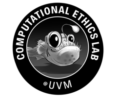

<div class="hero">
  <h1><strong class="title-strong">MetaOthello</strong><span class="title-semi">: A Controlled Study of Multiple World Models in Transformers</span></h1>

  <p class="authors">
    <a href="https://aviralchawla.github.io" target="_blank" rel="noopener">Aviral Chawla</a><sup>1,*</sup> &nbsp;
    <a href="https://galenhall.net" target="_blank" rel="noopener">Galen Hall</a><sup>2,*</sup> &nbsp;
    <a href="https://juniperlovato.com" target="_blank" rel="noopener">Juniper Lovato</a><sup>1</sup>
  </p>

  <p class="affiliations">
    <sup>1</sup>Vermont Complex Systems Institute, University of Vermont &nbsp;·&nbsp;
    <sup>2</sup>University of Michigan
  </p>

  <p class="equal-contrib">*Equal contribution</p>

  <p class="venue-caption">ICML 2026 &nbsp;·&nbsp; Seoul, South Korea</p>

  <div class="button-row">
    <a class="btn btn-primary" href="https://arxiv.org/abs/2602.23164" target="_blank" rel="noopener">arXiv</a>
    <a class="btn" href="https://github.com/aviralchawla/metaothello" target="_blank" rel="noopener">Code</a>
    <a class="btn" href="https://huggingface.co/aviralchawla/metaothello" target="_blank" rel="noopener">Models</a>
    <a class="btn" href="https://huggingface.co/datasets/aviralchawla/metaothello" target="_blank" rel="noopener">Dataset</a>
  </div>

  <aside class="abstract-box" aria-label="Abstract">
    <p class="abstract-body">
    Foundation models must learn many generative processes, yet mechanistic interpretability largely studies capabilities in isolation; it remains unclear how a single transformer organizes multiple, potentially conflicting &ldquo;world models&rdquo;. Building from previous work, we introduce <strong>MetaOthello</strong>, a controlled suite of Othello-like games with varying rules, and train small GPTs on mixed-game data. We show that transformers trained on multiple Othello variants learn <strong>shared world-state representations</strong>: linear probes trained on one game intervene on another&rsquo;s board state nearly as well as matched probes. When games conflict, the model resolves the resulting ambiguity through a localized mechanism we identify and steer. For isomorphic games with shuffled tokens, representations are equivalent up to a single orthogonal rotation that generalizes across layers, showing the shared structure is abstract rather than tied to surface form. Together, these results show that transformers reconcile conflicting world models by sharing structure and localizing conflict.
    </p>
  </aside>
</div>

<div class="hero-image-wrap">
  
  <p class="hero-caption">MetaOthello is a suite of Othello-like games played on the same 8&times;8 board, but follow different rules. We train small GPTs on sequences from mixtures of these games. We then probe the model to read &mdash; and intervene on &mdash; the board state it believes it is tracking. We show how the model learns to abstract across disparate games and, importantly, how it resolves ambiguity.</p>
</div>

<section id="findings">
<div class="wrap-wide">

## We Find

<div class="findings-grid">
  <div class="finding-card">
    <div class="finding-number">1</div>
    <h3>Shared Representations</h3>
    <p>Transformers learn to generalize shared abstractions. Board represenations for two disparate games is causally interchangeable.</p>
  </div>
  <div class="finding-card">
    <div class="finding-number">2</div>
    <h3>Shared Computation</h3>
    <p>Models perform game-general computations in early layers and then later identify game identity for game specific calculations.</p>
  </div>
  <div class="finding-card">
    <div class="finding-number">3</div>
    <h3>Ambiguity Circuit</h3>
    <p>When game sequences overlap and board representations are causally shared, we show mechanisms of how model resolve ambiguity.</p>
  </div>
</div>

</div>
</section>

<section id="cite">
<div class="wrap">

## Cite Us

If you find MetaOthello useful, please cite our paper:

</div>

<div class="wrap cite-wrap">

```bibtex
@inproceedings{chawla_hall_2026_metaothello,
  title     = {MetaOthello: A Controlled Study of Multiple World Models in Transformers},
  author    = {Chawla, Aviral and Hall, Galen and Lovato, Juniper},
  booktitle = {Proceedings of the 43rd International Conference on Machine Learning},
  series    = {Proceedings of Machine Learning Research},
  volume    = {306},
  year      = {2026},
  address   = {Seoul, South Korea},
  publisher = {PMLR}
}
```

</div>
</section>

<footer class="site-footer">
  <div class="footer-logos">
    <a class="logo-vcsi" href="https://vermontcomplexsystems.org" target="_blank" rel="noopener"></a>
    <a class="logo-cel" href="https://www.compethicslab.org" target="_blank" rel="noopener"></a>
  </div>
  <p>Vermont Complex Systems Institute, University of Vermont &nbsp;·&nbsp; University of Michigan</p>
</footer>
